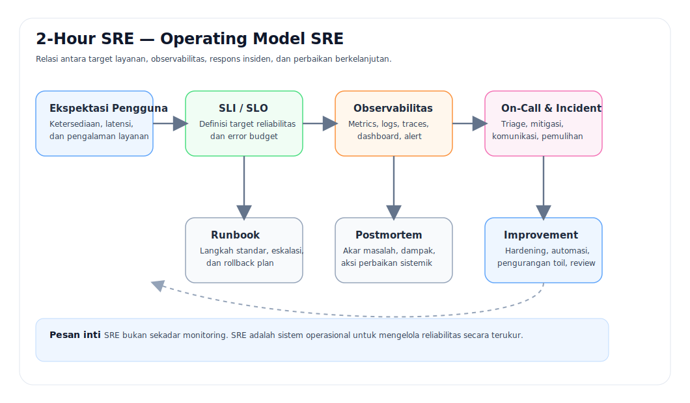

# 1 — Landasan SRE

- Kembali ke [Agenda](00-agenda.md)
- Bab berikutnya: [02 — Reliabilitas sebagai Target](./02-reliabilitas-sebagai-target.md)

---

## Definisi Kerja
**Site Reliability Engineering (SRE)** adalah disiplin operasional yang memastikan layanan digital tetap andal, terukur, dan dapat dipulihkan dengan cepat melalui kombinasi target layanan, observability, respons insiden, automasi, dan perbaikan berkelanjutan.

## Mengapa SRE Dibutuhkan
Dalam banyak organisasi, sistem gagal bukan karena tidak ada orang pintar, tetapi karena:
- target layanan tidak jelas,
- perubahan berjalan lebih cepat daripada kontrolnya,
- sinyal gangguan banyak tetapi tidak terarah,
- dokumentasi respons lemah,
- dan pembelajaran pasca-insiden tidak ditutup menjadi aksi.

SRE muncul untuk mengubah operasi dari **reaktif dan intuitif** menjadi **terukur dan sistematis**.

## Analogi Dunia Nyata
### Analogi 1 — Pasar tradisional yang ramai
Bayangkan sebuah pasar yang ramai setiap pagi.
- **Availability** berarti kios benar-benar buka saat pembeli datang.
- **Latency** berarti berapa lama pembeli menunggu dilayani.
- **Error rate** berarti berapa transaksi yang gagal atau salah hitung.
- **Saturation** berarti kapasitas penjual, kasir, dan stok mulai mencapai batas.

Pasar yang “masih buka” tetapi antrian sangat panjang, stok habis, dan pembayaran sering gagal tetap akan dianggap buruk oleh pembeli. Itulah alasan reliabilitas tidak bisa diukur hanya dengan pertanyaan “server masih hidup atau tidak”.

### Analogi 2 — Gedung dengan lift
Sebuah gedung bisa dianggap beroperasi, tetapi jika lift utama sering macet pada jam sibuk, pengalaman penggunanya tetap buruk. Dalam sistem digital, banyak layanan terlihat “up” dari luar, tetapi perjalanan pengguna di dalamnya tetap terganggu.

## Posisi SRE di Organisasi
| Fungsi | Fokus utama | Hubungan dengan SRE |
|---|---|---|
| Engineering / Development | Membangun fitur dan perubahan | SRE memberi guardrail agar perubahan tetap aman |
| Operations / Platform | Menjalankan infrastruktur dan layanan | SRE membantu standarisasi observability dan respons |
| Security / DevSecOps | Menjaga risiko keamanan perubahan dan lingkungan | SRE membantu melihat dampak operasional dari kontrol keamanan |
| Product / Business | Menentukan ekspektasi layanan | SRE menerjemahkannya menjadi target yang terukur |

## Diagram Operasional SRE

## Prinsip Inti
1. **Reliabilitas adalah produk**, bukan efek samping.
2. **Pengukuran harus mengubah keputusan**.
3. **Alert harus dapat ditindaklanjuti**.
4. **Otomasi dipakai untuk menurunkan beban kerja repetitif dan risiko manusia**.
5. **Insiden yang selesai tanpa pembelajaran adalah utang operasional baru**.

## Pertanyaan Reflektif
- Apakah layanan sudah memiliki definisi “baik” yang bisa dibuktikan?
- Jika pengguna mengeluh lambat, indikator teknis mana yang pertama kali dilihat?
- Apakah tim lebih sering sibuk memadamkan api daripada menutup penyebab kebakaran?
