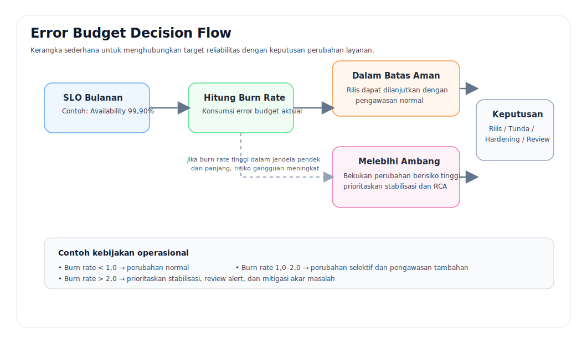

# 2 — Reliabilitas sebagai Target

- Bab sebelumnya: [01 — Landasan SRE](./01-landasan-sre.md)
- Bab berikutnya: [03 — Observability dan Alerting](./03-observability-dan-alerting.md)

---

## Istilah Inti
| Istilah | Arti praktis | Contoh |
|---|---|---|
| SLI | Ukuran perilaku layanan yang diamati | availability, latency p95, error rate |
| SLO | Target minimum yang disepakati | availability 99,90% per 30 hari |
| SLA | Komitmen layanan ke pihak eksternal | kompensasi bila target gagal |
| Error Budget | Ruang toleransi kegagalan dalam window tertentu | 0,10% per 30 hari |

## Analogi Dunia Nyata
### Analogi 1 — Toko online dan pengiriman
Sebuah toko online menjanjikan bahwa pesanan harus dapat diproses dengan cepat dan akurat.
- **SLI** adalah hal yang benar-benar diukur, misalnya berapa persen checkout berhasil, berapa lama proses pembayaran, dan berapa banyak transaksi timeout.
- **SLO** adalah target internal, misalnya 99,90% checkout sukses.
- **SLA** adalah janji resmi ke pelanggan, misalnya kompensasi jika layanan gagal memenuhi kontrak.
- **Error budget** adalah toleransi gangguan yang masih dianggap “dapat diterima” sebelum organisasi harus menahan laju perubahan.

Analogi sederhananya: sebuah toko boleh sesekali mengalami gangguan, tetapi jika gangguan itu menghabiskan “jatah toleransi”, maka membuka promosi besar atau merilis fitur baru tanpa stabilisasi adalah keputusan yang ceroboh.

### Analogi 2 — Jalan tol
Jalan tol yang masih bisa dilalui tidak otomatis berarti baik.
- Jika 95% kendaraan lewat lancar tetapi 5% terjebak macet ekstrem, pengalaman pengguna tetap buruk.
- Karena itu, **persentil** seperti p95 lebih berguna daripada rata-rata biasa untuk banyak kasus latency.

## Diagram Error Budget

## Contoh Definisi SLI dan SLO
| Layanan | SLI | Target SLO | Window | Ambang perhatian |
|---|---|---:|---|---|
| Checkout | Availability | 99,90% | 30 hari | burn rate > 1,0 |
| Checkout | Latency p95 | < 250 ms | 30 hari | > 250 ms selama 10 menit |
| Checkout | Error rate | < 0,50% | 30 hari | > 0,50% selama 5 menit |

## Cara Membaca Error Budget
Jika target availability adalah **99,90%**, maka error budget-nya adalah **0,10%** dalam satu window.

Artinya organisasi masih memiliki ruang kecil untuk kegagalan. Ruang ini bukan untuk dihabiskan dengan santai, melainkan dipakai sebagai alat keputusan:
- ketika burn rate sehat, perubahan normal dapat berjalan,
- ketika burn rate mulai agresif, perubahan berisiko perlu ditinjau ulang,
- ketika budget hampir habis, stabilisasi harus lebih diutamakan daripada laju rilis.

## Kesalahan Umum
| Kesalahan | Mengapa berbahaya |
|---|---|
| Memilih SLI yang mudah diambil tetapi tidak mewakili pengalaman pengguna | Tim merasa aman, pengguna tetap merasa rusak |
| Menetapkan SLO terlalu tinggi tanpa kemampuan operasional yang memadai | Target menjadi formalitas dan tidak dipercaya |
| Tidak menghubungkan error budget dengan keputusan perubahan | SLO hanya menjadi pajangan dashboard |
| Menyamakan SLA dengan SLO | Komitmen eksternal dan target internal punya fungsi yang berbeda |

## Grafik Contoh

## Pertanyaan Reflektif
- Apakah target layanan saat ini mewakili apa yang benar-benar dirasakan pengguna?
- Jika budget reliabilitas menipis, keputusan apa yang harus diubah lebih dahulu?
- Apakah organisasi punya keberanian menunda perubahan demi stabilitas ketika datanya memang menunjukkan risiko?
