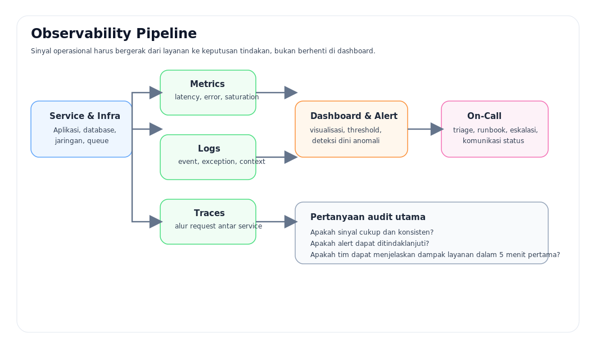
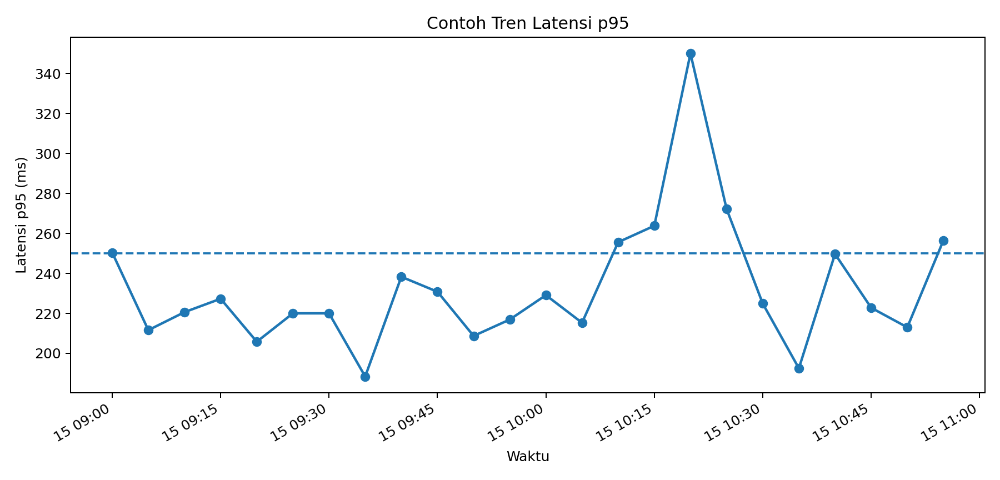
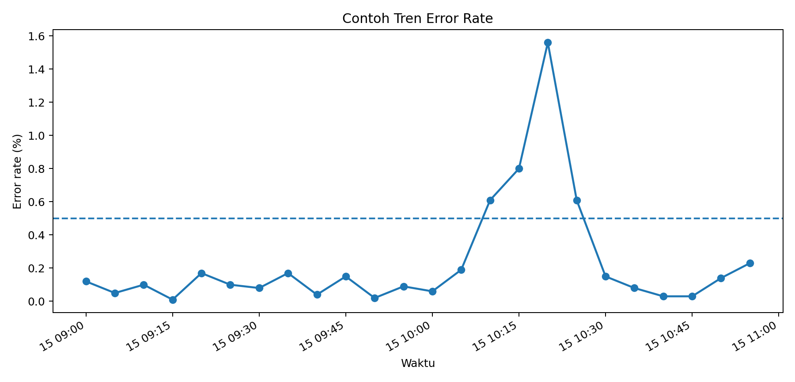

# 3 — Observability dan Alerting

> Bagian dari paket **2-Hour SRE**. Gunakan file ini untuk presentasi fokus per topik atau saat ingin berpindah chapter tanpa kehilangan struktur.

- Bab sebelumnya: [02](./02-reliabilitas-sebagai-target.md)
- Bab berikutnya: [04](./04-incident-response-dan-runbook.md)

---

## Prinsip
Observability yang baik bukan hanya banyak dashboard, melainkan kemampuan menjawab:
1. Apa yang sedang rusak?
2. Seberapa besar dampaknya?
3. Perubahan apa yang kemungkinan memicu gejala tersebut?
4. Langkah mitigasi pertama apa yang paling aman?

## Diagram Observability


## Tabel Audit Observability
| Domain | Pertanyaan Audit | Bukti Minimum |
|---|---|---|
| Metrics | Apakah ada metrik untuk latency, traffic, errors, saturation? | Dashboard, query, screenshot |
| Logs | Apakah log memiliki context yang cukup (request ID, trace ID, service, severity)? | Potongan log |
| Traces | Apakah alur antar service dapat ditelusuri? | Trace sample |
| Alert | Apakah alert mencantumkan severity, owner, dan runbook? | Rule alert |
| Dashboard | Apakah dashboard dapat dipakai untuk triage dalam 5 menit pertama? | Link dashboard |

## Sampel Metrics
File sumber: `samples/sample-metrics.csv`

| Waktu | Latency p95 (ms) | Error rate (%) | CPU util (%) |
|---|---:|---:|---:|
| 09:00 | 250.4 | 0.12 | 60.2 |
| 09:25 | 220.0 | 0.10 | 60.0 |
| 09:50 | 208.7 | 0.02 | 57.2 |
| 10:10 | 255.6 | 0.61 | 62.2 |
| 10:15 | 263.8 | 0.80 | 79.6 |
| 10:20 | 350.0 | 1.56 | 69.9 |
| 10:40 | 249.7 | 0.03 | 55.6 |
| 10:55 | 256.5 | 0.23 | 55.7 |

### Visual Tren Latensi


### Visual Tren Error Rate


## Sampel Log Aplikasi
File sumber: `samples/sample-log-app.txt`

```log
2026-01-15T10:14:51.221Z level=INFO service=checkout env=prod request_id=3ad9e2b8a7f8 trace_id=41d71f2cb2bf11d4 msg="request accepted" method=POST path=/api/v1/checkout user_id=usr-10321 cart_items=3
2026-01-15T10:15:02.044Z level=WARN service=checkout env=prod request_id=1259cb4c9ae1 trace_id=41d71f2cb2bf11d4 msg="upstream latency elevated" upstream=payment-gateway elapsed_ms=873
2026-01-15T10:15:03.015Z level=ERROR service=checkout env=prod request_id=1259cb4c9ae1 trace_id=41d71f2cb2bf11d4 msg="checkout failed" error_code=PAYMENT_TIMEOUT http_status=504 elapsed_ms=1504 customer_tier=premium
```

## Sampel Rule Alert
File sumber: `samples/sample-prometheus-alerts.yml`

```yaml
groups:
  - name: sre-demo.rules
    rules:
      - alert: CheckoutErrorRateHigh
        expr: sum(rate(http_requests_total{service="checkout",status=~"5.."}[5m])) / sum(rate(http_requests_total{service="checkout"}[5m])) > 0.005
        for: 5m
        labels:
          severity: critical
          team: sre
        annotations:
          summary: "Error rate checkout melebihi 0,5%"
          description: "Aktifkan triage, validasi dampak pengguna, dan pertimbangkan rollback."
```

## Checklist Cepat Review Alert
- Nama alert menjelaskan gejala, bukan sekadar nama metrik.
- Severity sesuai dampak layanan.
- Ada runbook atau langkah awal yang jelas.
- Alert cukup stabil; tidak terlalu sensitif dan tidak terlalu lambat.
- Alert selaras dengan SLO, bukan hanya sekadar threshold teknis.

---
