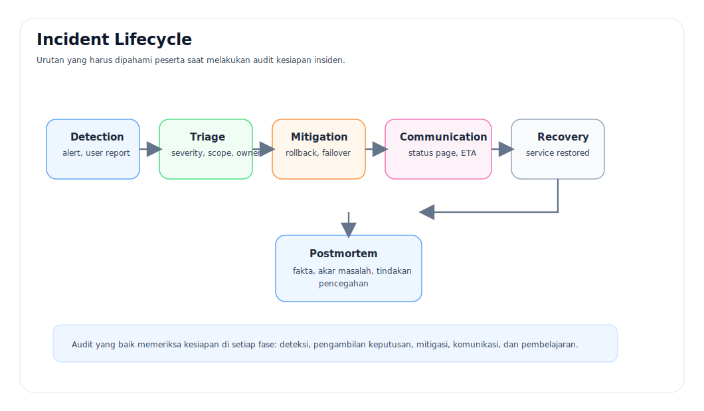

# 4 — Incident Response dan Runbook

- Bab sebelumnya: [03 — Observability dan Alerting](./03-observability-dan-alerting.md)
- Bab berikutnya: [05 — Postmortem dan Perbaikan Sistemik](./05-postmortem-dan-perbaikan-sistemik.md)

---

## Mengapa Tahap Ini Penting
Sistem tidak dinilai hanya dari seberapa jarang gagal, tetapi juga dari **seberapa cepat dikenali, ditangani, dan dipulihkan** saat gangguan muncul.

## Analogi Dunia Nyata
### Analogi 1 — Ruang gawat darurat
Pada rumah sakit, pasien tidak bisa ditangani dengan urutan “siapa yang datang dulu” saja. Dibutuhkan **triage**:
- siapa yang paling kritis,
- gejala apa yang paling berbahaya,
- tindakan apa yang harus dilakukan lebih dulu,
- siapa dokter atau unit yang paling tepat menangani.

Incident response bekerja dengan logika yang sama. Tanpa triage, tim mudah tenggelam dalam banyak sinyal tetapi terlambat mengambil tindakan yang benar.

### Analogi 2 — Pemadam kebakaran gedung
Ketika alarm berbunyi, tim tidak memulai dari rapat panjang. Mereka perlu:
1. memastikan apakah alarm valid,
2. mengetahui lokasi masalah,
3. melokalisasi dampak,
4. menjalankan prosedur aman,
5. lalu memastikan gedung benar-benar aman sebelum dinyatakan pulih.

Runbook adalah bentuk tertulis dari disiplin tersebut.

## Diagram Siklus Insiden

## Fokus Pengawasan Saat Insiden
| Fase | Pertanyaan utama |
|---|---|
| Detection | Apakah gejala terdeteksi cepat dan dapat dipercaya? |
| Triage | Apakah scope, severity, dan owner segera jelas? |
| Mitigation | Apakah langkah mitigasi pertama aman dan terdokumentasi? |
| Communication | Apakah pemangku kepentingan menerima pembaruan yang konsisten? |
| Recovery | Apakah indikator pemulihan didefinisikan secara objektif? |
| Postmortem | Apakah pembelajaran diubah menjadi aksi yang dapat ditutup? |

## Karakteristik Runbook yang Baik
- Memiliki trigger yang jelas.
- Menjelaskan langkah konfirmasi awal.
- Menyediakan urutan triage yang aman.
- Menjelaskan opsi mitigasi, rollback, atau failover.
- Menentukan pihak yang harus dihubungi.
- Memiliki kriteria recovery yang objektif.
- Memisahkan tindakan **diagnosis** dari tindakan **perubahan** agar risiko semakin terkendali.

## Contoh Pertanyaan Triage
- Apakah gangguan bersifat lokal, regional, atau global?
- Apakah hanya pengguna premium, hanya jalur checkout, atau seluruh layanan terdampak?
- Apakah ada deployment, perubahan konfigurasi, atau dependency eksternal yang baru berubah?
- Apakah lebih aman rollback, failover, scale out, atau mode degradasi?

## Referensi Template
- [Sample Runbook](../templates/sample-runbook.md)
- [Template Alert Review](../templates/template-alert-review.md)

## Kesalahan Umum Saat Insiden
| Kesalahan | Dampaknya |
|---|---|
| Semua orang langsung bereaksi tanpa pembagian peran | Kebisingan meningkat, keputusan melambat |
| Tidak ada owner insiden yang jelas | Banyak aksi, sedikit arah |
| Tidak ada kriteria recovery | Layanan dianggap pulih padahal gejalanya bisa kembali |
| Komunikasi tertinggal | Pemangku kepentingan membuat asumsi sendiri |

## Pertanyaan Reflektif
- Jika alert kritis aktif sekarang, siapa yang pertama bergerak dan apa langkah awalnya?
- Apakah tim memiliki runbook yang cukup rinci untuk tindakan 15 menit pertama?
- Berapa banyak waktu yang biasanya hilang hanya untuk memastikan siapa pemilik masalahnya?
